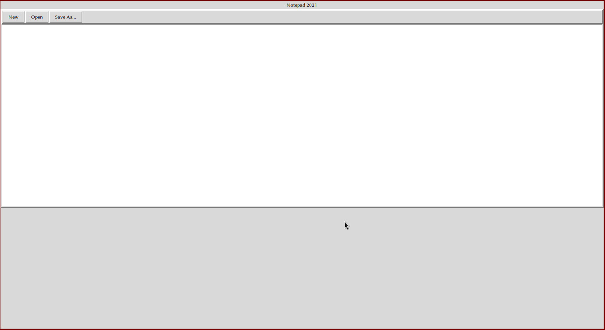
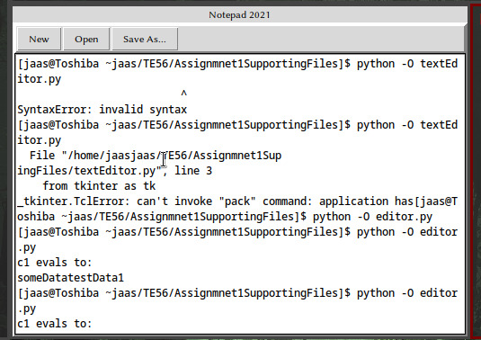
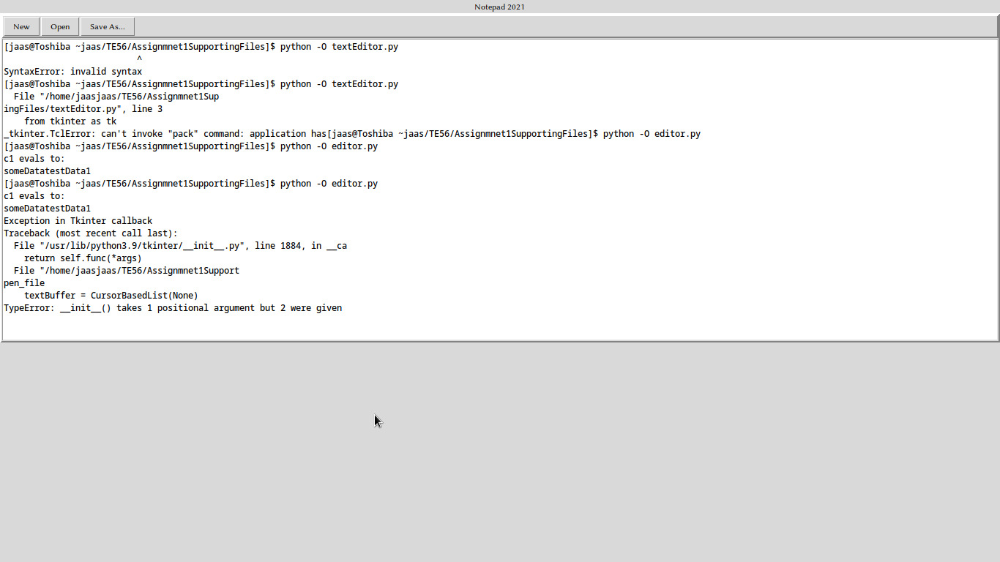
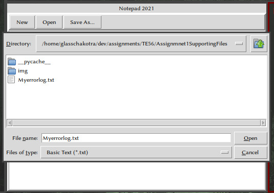

# Notepad 2021

> The note taking app built in python

## Intro

Note taking is a very crucial process for every profession and it's requirement can not be under stated. Therefore I made this application to fulfill my requirement of taking notes while reducing system load. Therefore Notepad 2021 is presented.

## Usage

Typical usage includes opening, creating and saving text files.

### Creating a New File

Simply run the program and start typing.

### Opening a file

The program can read basic ASCII / UNICODE based text files. Click the `Open` button and you wll be rompted with a file browser depending on your OS. Select the file you wish to edit and hit `OK`. The contents of the file will be loaded into the editor.

### Saving Changes

Click the "Save As..." Button and save the file wherever you require.

## Screenshots

-----------------------

*****************

-----------------------

-----------------------
